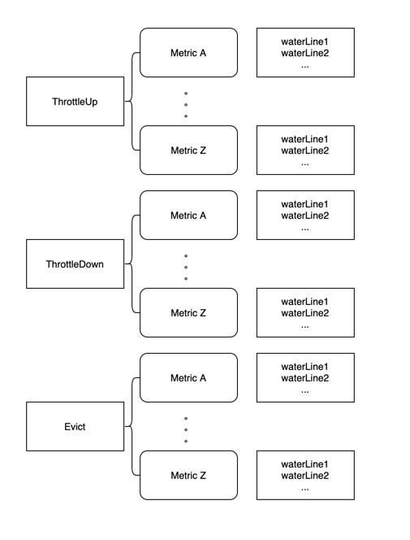

# Pod Sorting And Precise Execution For Crane Agent
该proposal能够在保证节点整体qos的前提下，尽可能减少对当前节点上低优先级服务的影响；在executor阶段，从cpu，memory等更多维度去排序需要被执行操作的pod，而不仅仅是依赖ProrityClass；另外会依照实时用量和水位线的差距以及执行操作后pod所释放出来的资源用量进行细粒度的驱逐或压制操作，减少过度的对低优先级服务进行压制(驱逐)的操作。

## Table of Contents

<!-- TOC -->

- [Pod Sorting And Precise Execution For Crane Agent](#Pod Sorting And Precise Execution For Crane Agent)
    - [Table of Contents](#table-of-contents)
    - [Motivation](#motivation)
        - [Goals](#goals)
        - [Non-Goals/Future Work](#non-goalsfuture-work)
    - [Proposal](#proposal)
        - [支持更多指标的排序策略](#支持更多指标的排序策略)
        - [以水位线为基准进行pod的操作](#以水位线为基准进行pod的操作)
        - [User Stories](#user-stories)

<!-- /TOC -->
## Motivation
当前在crane agent中，当超过NodeQOSEnsurancePolicy中指定的水位线后，执行evict，throttle等操作时会对低优先级的pod进行排序，当前排序的依据是pod的ProrityClass，之后对排序的pod进行throttle或者evict操作； 
存在的问题有：

1. 排序的依据是比较简单的，只能参考ProrityClass，无法满足基于其他特性的排序，也无法尽快让节点达到指定的水位线

2. 当前的工作模式在触发NodeQOSEnsurancePolicy中的指标值后进行驱逐/压制操作时，会对于节点上的所有低于指定ProrityClass的pod进行操作；举一个例子，当前节点上有10个pod低于指定ProrityClass，
在触发水位线后，会对这10个pod都进行操作，但是实际上可能在操作完成一个pod的时候就可以低于NodeQOSEnsurancePolicy中的指标值了，剩下的pod的操作，其实是过度的，如果能以NodeQOSEnsurancePolicy中的
指标值作为水位线对pod进行精确的操作，操作到刚好低于水位线是更为合适的；能避免对低优先级服务的过度影响。

### Goals

- 实现除了ProrityClass以外的其他指标的排序方法，比如以pod cpu用量为主要参照的排序，以pod内存用量为主要参照的排序
- 在对pod进行操作时以NodeQOSEnsurancePolicy中的指标值为水位线，当操作后节点的用量低于水位线值时，即可停止对pod的操作，避免过度操作

## Proposal
### 支持更多指标的排序策略
除了当前的ProrityClass外，将会支持以cpu用量，内存用量为指标对pod进行排序；

针对一般的指标，会首先比较pod的优先级，之后比较pod对应指标的用量，之后比较pod的运行时长，有一个维度可以比较出结果即为pod的排序结果；

这里以CPU用量排序为例，会依次比较两个pod的优先级，如果优先级相同的情况下，再比较cpu用量，如果cpu用量也相同的情况下继续比较ext cpu资源用量（这个是cpu属性较为特殊的一点）, 最后比较pod的运行时长，当某一个指标存在差异时即可返回比较结果

同时提供一个默认的自定义指标的排序构造方法；指标metric的排序方法记作：<metric>SortPod

只需要传入对应的metric name，同时实现<metric>-sort-func即可
```go
func General<Metric>Sorter(pods []podinfo.PodContext, <metric> string) {
    orderedBy(classAndPriority, <metric>-sort-func, runningTime).Sort(pods)
}
```

### 以水位线为基准进行pod的操作
#### analyzer阶段：  
1.通过多个NodeQOSEnsurancePolicy及其中的objectiveEnsurances构建多条水位线；

首先按照objectiveEnsurances对应的action进行分类，目前crane-agent有3个针对节点Qos进行保障的操作，分别是Evict，ThtottleDown（当前用量高于objectiveEnsurances中的值时对pod进行用量压制）和ThrottleUp（当前用量低于objectiveEnsurances中的值时对pod的用量进行放宽恢复）

2.之后对objectiveEnsurances中同一操作种类中的水位线按照其metric rule（图中以metric A，metric Z作为示意）进行分类缓存，每个objectiveEnsurances水位线的值记为waterLine1，waterLine2等；

最终形成一个类似下图的数据存储：


3.依据上面的图示，结合当前节点的指标用量与该指标对应的水位线中最小值的差值构造如下的数据结构，需要注意对于ThrottleUp，需要用水位线最小值-当前用量作为gap值，对于其他两者，使用当前用量-水位线最小值作为gap值，即始终保持gap值为正
下面三个数据分别代表了需要执行evict，ThtottleDown和ThrottleUp操作的指标及其对应的到最低水位线的差值
```go
EvictGapToWaterLines[metrics]     
ThrottoleDownGapToWaterLines[metrics]
ThrottleUpGapWaterLine[metrics]
```
#### 可量化metric
在这些不同metric构造的水位线中，有一些metric是较为特殊的，我们将其称为可量化的metric，具体又分为驱逐可量化metric和压制可量化metric；

压制可量化metric指的是，这些metric都有对应的throttle实现，且能准确计算出经过压制后释放的资源数量，比如cpu用量，可以通过限制cgroup用量进行压制，同时可以通过当前运行值和压制后的值计算压制后释放的cpu使用量；
而比如memory usage就不属于压制可量化metric，因为memory没有对应的throttle实现，也就无法准确衡量压制一个pod后释放出来的memory资源具体用量；

驱逐可量化metric是指这些metric在对应pod被执行驱逐操作后，可以准确获取该pod被驱逐后对应metric的释放量。cpu usage和memory usage都属于驱逐可量化metric，驱逐后的释放量就是pod运行时所占用的用量。

这么区分的原因是对于不可量化的指标，我们无法评估压制或者驱逐一个pod到底会释放多少资源，也就无法精确计算离该指标对应的水位线的差距。

为了便于下文叙述，我们记 驱逐可量化metric 为evictMetricList，记压制可量化metric 为throttleMetricList。
这两种list中的metric都是有顺序的，按照不可压缩资源->可压缩资源排序，这也表明了执行具体操作时的顺序，比如为evictMetricList中memory会优先于cpu，因为memory属于不可压缩资源，执行驱逐时会首先满足memory的水位线要求，尽量保证节点的QoS不受影响。

#### executor阶段：
1.首先根据当前执行动作判断水位线中是否存在不可量化的指标，也就是不存在于上文MetricList中的；如果存在，那么对所有的pod进行操作，因为我们无法知道操作一个pod会释放多少的该资源，也就无法准确评估到水位线的距离；

2.如果不存在不可量化指标，则在执行前再获取一次所有水位线（上文的EvictGapToWaterLines，ThrottleDownWaterLine，ThrottleUpWaterLine）中涉及的metrics的节点的最新使用量，如果有获取不到metric用量的，因为缺失造成无法预估资源释放多少合适，所以将对所有pod进行操作；

3.执行阶段：

针对压制：  

按照throttleMetricList中的指标对应的排序方式对pod进行排序后，在没有达到对应metric的水位线前，按顺序取出一个pod，执行压制操作，并计算释放的该metric对应的资源量，同时在水位线中减去该释放的值，直到满足水位线要求

针对驱逐：

按照evictMetricList中的指标对应的排序方式对pod进行排序后，在没有达到对应metric的水位线前，取出一个没有执行过的pod，执行驱逐操作，并计算释放出的各metric资源量，同时在对应水位线中减去释放的值，直到满足当前metric水位线要求
```go

GetLatestUsage() //获取最新的指标用量，用于保证在执行操作前的数据时效性
do throttle:
    for <metric> in throttleMetricList{
		<metric>SortPod() //按照metric对应的排序方式对pod进行排序
        podIndex:=0
        for !ThrottoleDownGapToWaterLines[<metric>] reached{
            pod=SortedPodList[podindex]
            Throttle(pod)
            realsed<metric>:= Construct<metric>Release(pod) //获取压制该pod后，释放的对应metric的资源量
            ThrottoleDownGapToWaterLines[<metric>]-=realsed<metric>
            podindex++
        }
    }
	
do evict:
    for <metric> in evictMetricList{
        <metric>SortPod() //按照metric的排序方式对pod进行排序
        for !EvictGapToWaterLines[<metric>] reached{
            if Find pod NoExecuted {
                Evict(pod)
                markAsExecuted(pod)
                for <metric> in evictMetricList{
                    realsed<metric>:= Construct<metric>Release(pod) //获取压制该pod后，释放的各个evictMetricList中metric的资源量
                    EvictGapToWaterLines[<metric>]-=realsed<metric>
                }
            }
        }
    }

``` 

### Non-Goals/Future Work

- 暂时不支持自定义指标的排序
- 当前只支持CPU和memory维度的精确操作，避免针对这两个指标的NodeQOSEnsurancePolicy的过度操作

### User Stories

- 用户可以更为精确地使用agent进行QoS保障，避免影响过多的低优先级的pod，提升业务的稳定性

